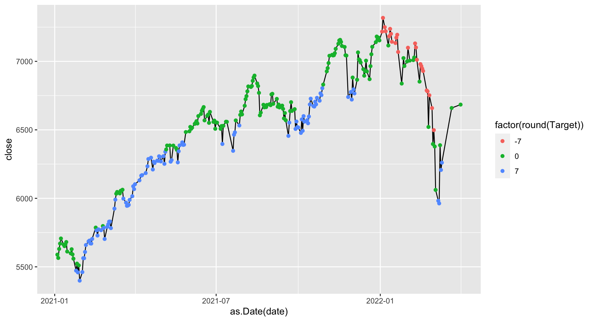

# Readme

# Historical Data

-   HISTORICAL_FCHI.csv : [Yahoo
    Finance](https://fr.finance.yahoo.com/quote/%5EFCHI/history?p=%5EFCHI)

-   HISTORICAL_INTERBANK_RATES.csv : [Banque de
    France](http://webstat.banque-france.fr/fr/downloadFile.do?id=5385564&exportType=csv)

-   HISTORICAL_CHANGE_RATES.csv : [Banque de
    France](http://webstat.banque-france.fr/fr/downloadFile.do?id=5385698&exportType=csv)

-   HISTORICAL_VIX.csv : [Yahoo
    Finance](https://finance.yahoo.com/quote/%5EVIX/history?period1=631238400&period2=1649462400&interval=1d&filter=history&frequency=1d&includeAdjustedClose=true)
    CBOE Volatility Index (^VIX)

-   HISTORICAL_VIX_FROM_2004.csv :
    [CBOE](https://cdn.cboe.com/api/global/us_indices/daily_prices/VIX_History.csv)

-   HISTORICAL_VXD.csv :
    [CBOE](https://cdn.cboe.com/api/global/us_indices/daily_prices/VXD_History.csv)
    DJIA VOLATILITY

# Graph

```{r}
library(fin.backend)
library(ggplot2)

dt <- data_tools.load_raw_data("t", "2022-04-01")

dt_plot <- data_tools.flat_raw_data(dt, 7, "2022-04-01", "2015-01-01")

ggplot(dt_plot[date >= "2021-01-01", .(date, close, Target)]) + geom_line(aes(x = as.Date(date), y = close)) + geom_point(aes(x = as.Date(date), y = close, color = factor(round(Target))))
```


