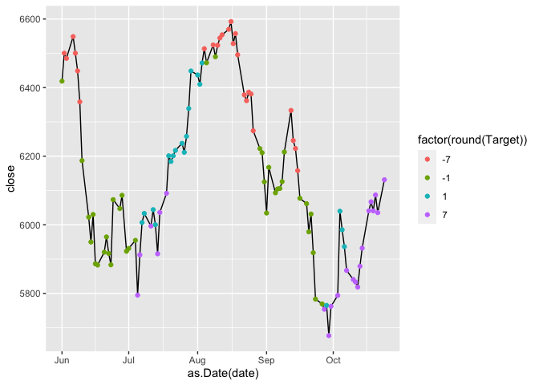

<!-- README.md is generated from README.Rmd. Please edit that file -->

# fin.backend

This is a basic `R` package used in AI forecasts, which is intended to
define loading functions, technical indicator calculations and
rebalancing data. Its specific objective is also to calculate  
target values.

This R package is intended to be part of a trading signals application.

## Quick Guide

``` r
library(fin.backend)
library(future)
library(ggplot2)

plan(multisession)

dt <- data_tools.load_raw_data("CAC_40", "2022-11-11")

dt_plot <- data_tools.flat_raw_data(dt, 7, "2022-11-11", "2022-06-01")

ggplot(dt_plot[date >= "2022-06-01", .(date, close, Target)]) + geom_line(aes(x = as.Date(date), y = close)) + geom_point(aes(x = as.Date(date), y = close, color = factor(round(Target))))
```



``` r

plan(sequential)
```

## Data

- Historical FCHI : [Yahoo
  Finance](https://fr.finance.yahoo.com/quote/%5EFCHI/history?p=%5EFCHI)

- Historical InterBank exchanges rates : [Banque de
  France](http://webstat.banque-france.fr/fr/downloadFile.do?id=5385564&exportType=csv)

- Historical currencies rates : [Banque de
  France](http://webstat.banque-france.fr/fr/downloadFile.do?id=5385698&exportType=csv)

- Historical VIX : [Yahoo
  Finance](https://finance.yahoo.com/quote/%5EVIX/history?period1=631238400&period2=1649462400&interval=1d&filter=history&frequency=1d&includeAdjustedClose=true)
  CBOE Volatility Index (^VIX)

- Other historical VIX :
  [CBOE](https://cdn.cboe.com/api/global/us_indices/daily_prices/VIX_History.csv)

- Historical VXD :
  [CBOE](https://cdn.cboe.com/api/global/us_indices/daily_prices/VXD_History.csv)
  DJIA Volatility

## Restricted User Guide

### Manage MongoDB

#### Clean-up (if needed)

- DB is located under `~/fin.db`
- Delete all files in `./fin.db/mongo-db/*`
- Delete log file `./fin.db/log/mongo.log`

#### Start the DB

- DB is located under `~/fin.db`
- Execute `./fin-db/mongo.sh`

### Manage R project

- R project is located under `~/fin.backend`

#### Build with RStudio

- Onglet `Build` / `More` / `Clean and Install`

``` bash
    Restarting R session...

    * Project '~/fin.backend' loaded. [renv 0.16.0]
    > library(fin.backend)
    > 
```

- Put the downloaded CSV data under `./fin.backend/inst/testdata/`
  directory
- Execute the import function `init-db.import_data()`

### Export data to CSV

``` r
library(fin.backend)
library(future)
library(progress)

plan(multisession)

export_csv.X_y("CAC_40", "2022-11-11", "2022-11-01", "~/fin.data/")

plan(sequential)
```
